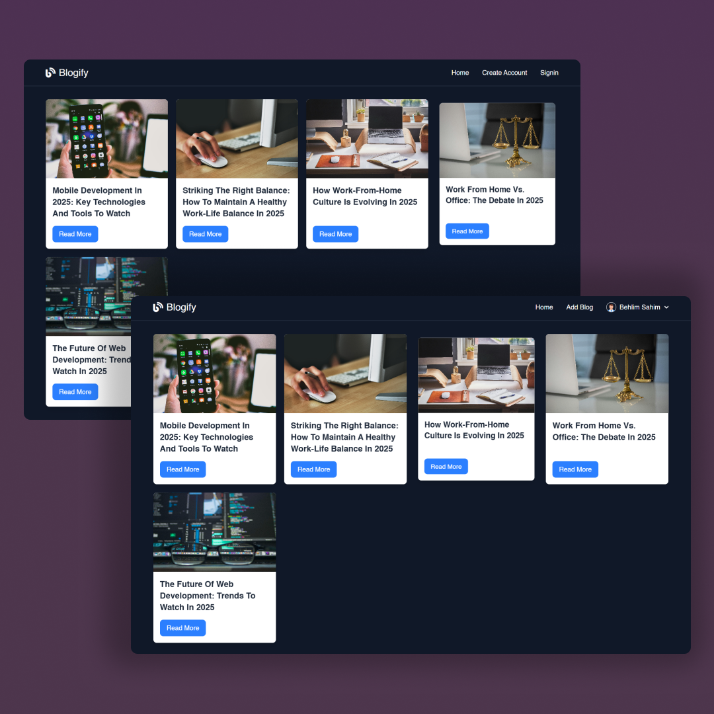
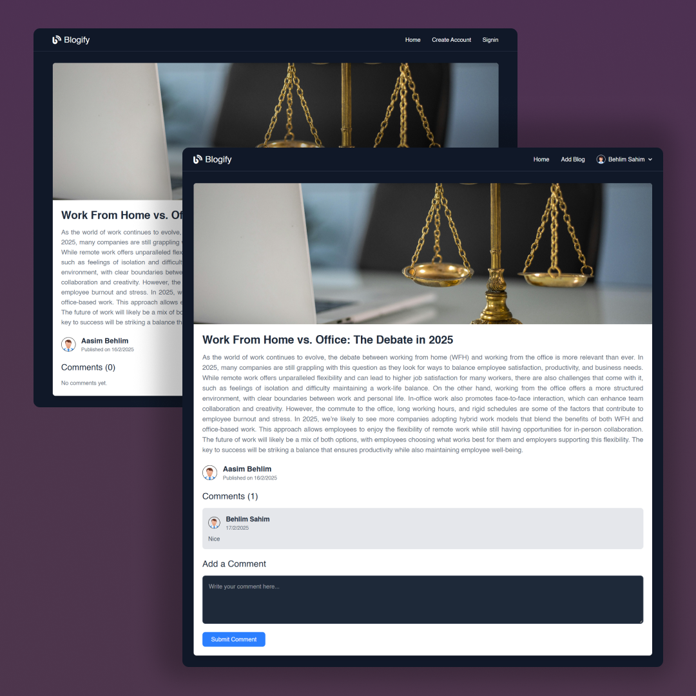
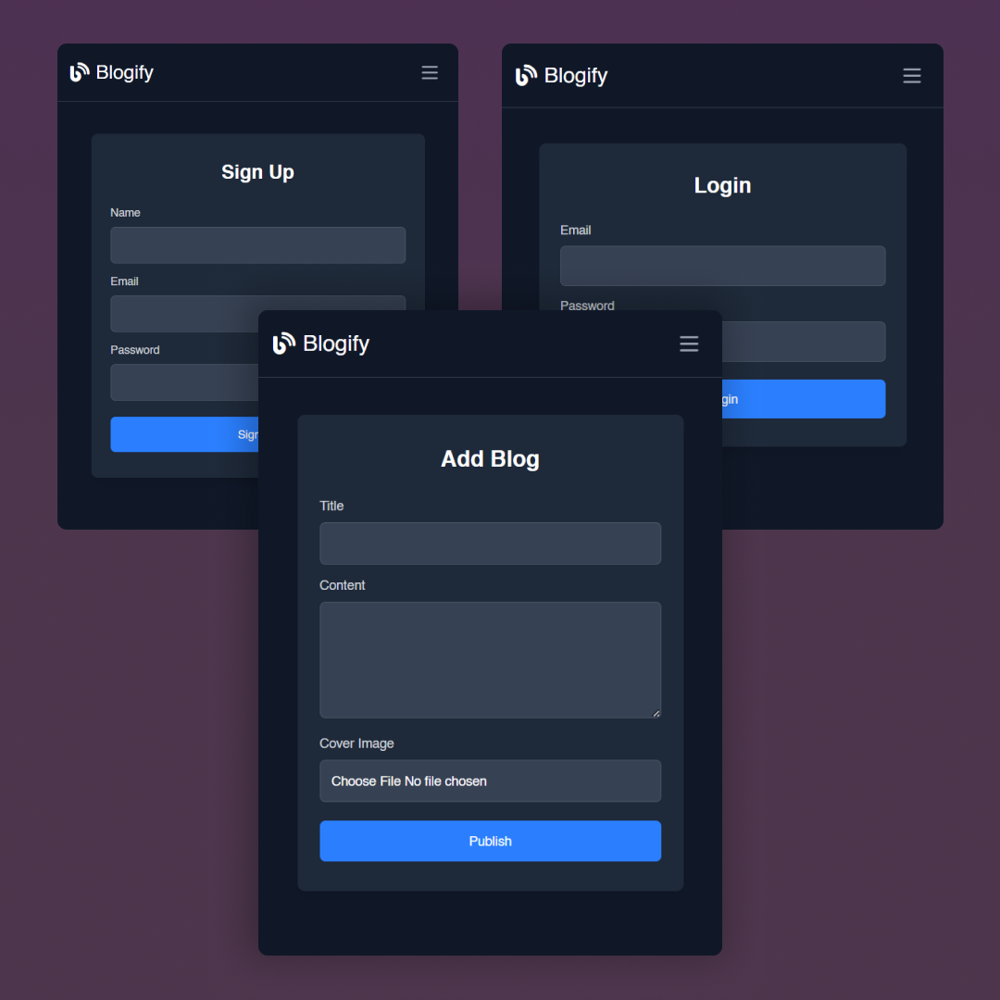

# 📝 Blog Platform

A simple and elegant blog platform built with **Node.js, Express, EJS, MongoDB and JWT authentication**. Users can create, read, and delete blog posts while ensuring secure authentication.

## 🚀 Features

- User authentication with JWT
- Create, read, and delete blogs
- View blogs with author details and comments
- Responsive Tailwind CSS design
- File upload support for blog cover images

## 🛠 Tech Stack

- **Frontend:** HTML, EJS, Tailwind CSS
- **Backend:** Node.js, Express.js
- **Database:** MongoDB
- **Authentication:** JSON Web Tokens (JWT)
- **File Uploads:** Multer

## 📸 Screenshots

| Home Page                         | Blog Post                          | Pages                           |
| --------------------------------- | ---------------------------------- | ------------------------------- |
|  |  |  |

## 🔗 API Endpoints

### User

| Method | Endpoint     | Description                    | Auth Required |
| ------ | ------------ | ------------------------------ | ------------- |
| POST   | /user/signup | Register a new user            | ❌ No         |
| POST   | /user/login  | Login user & get JWT           | ❌ No         |
| GET    | /user/logout | Logout user (invalidate token) | ✅ Yes        |

### Blog

| Method | Endpoint              | Description             | Auth Required |
| ------ | --------------------- | ----------------------- | ------------- |
| POST   | /blog/add             | Create a new blog       | ✅ Yes        |
| POST   | /blog/:blogID/comment | Add a comment to a blog | ✅ Yes        |
| GET    | /blog/:blogID         | Get a single blog by ID | ❌ No         |
| DELETE | /blog/:blogID         | Delete a blog           | ✅ Yes        |

## 🚧 Future Enhancements

- Blog editing functionality
- User profile management
