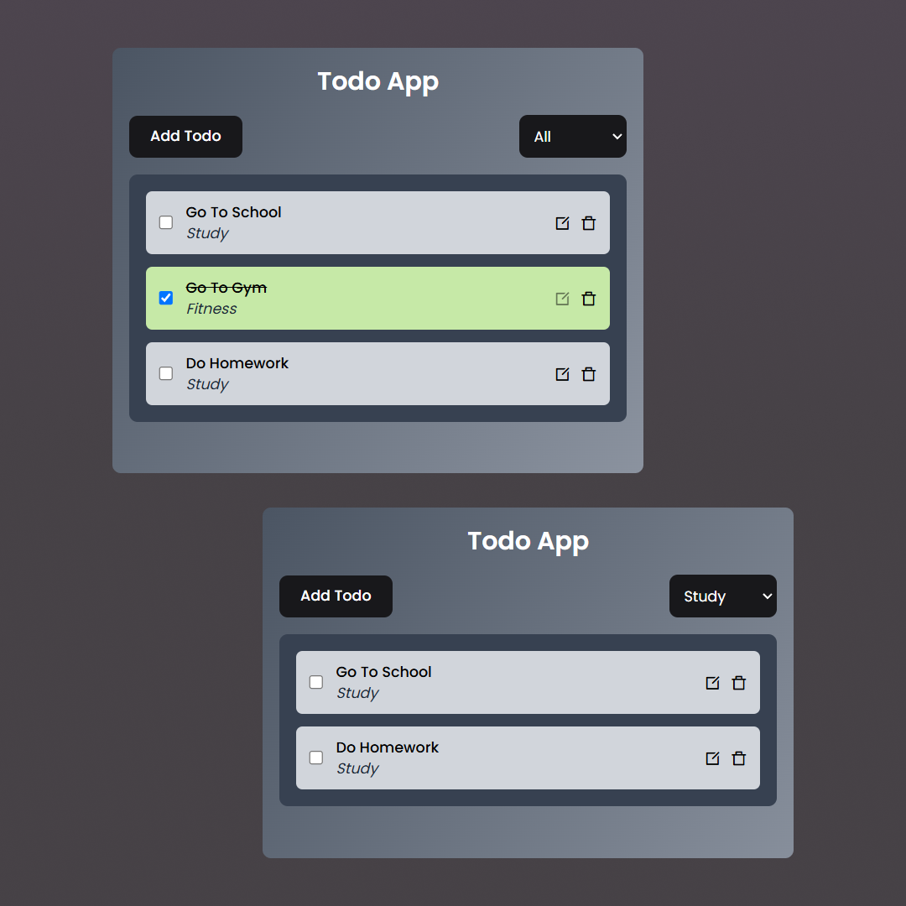

# 📝 Todo App (MERN Stack)

A simple **Todo App** built using **MERN Stack** (MongoDB, Express, React, Node.js). This app allows users to **add, edit, delete, filter**, and **toggle the completion status** of tasks.

## 🚀 Features

- ✅ Add new todos with categories (Work, Personal, Study, Fitness)
- ✏️ Edit existing todos
- ❌ Delete todos
- 🔄 Toggle completion status
- 🔍 Filter todos by category
- 🌐 Fully responsive UI with **React + Tailwind CSS**

## 🛠️ Tech Stack

### **Frontend**

- ⚛️ React (Vite)
- 🎨 Tailwind CSS
- 🔗 Axios (for API calls)
- 🔥 React Toastify (for notifications)

### **Backend**

- 🏗️ Node.js & Express
- 🗂️ MongoDB (Mongoose)
- 🌍 CORS & dotenv

## 🎯 API Endpoints

| Method | Endpoint                   | Description              |
| ------ | -------------------------- | ------------------------ |
| GET    | /api/todos                 | Fetch all todos          |
| POST   | /api/todos                 | Add a new todo           |
| PATCH  | /api/todos/:id             | Update a todo            |
| DELETE | /api/todos/:id             | Delete a todo            |
| PATCH  | /api/todos/isCompleted/:id | Toggle completion status |

## 🎨 UI Preview

