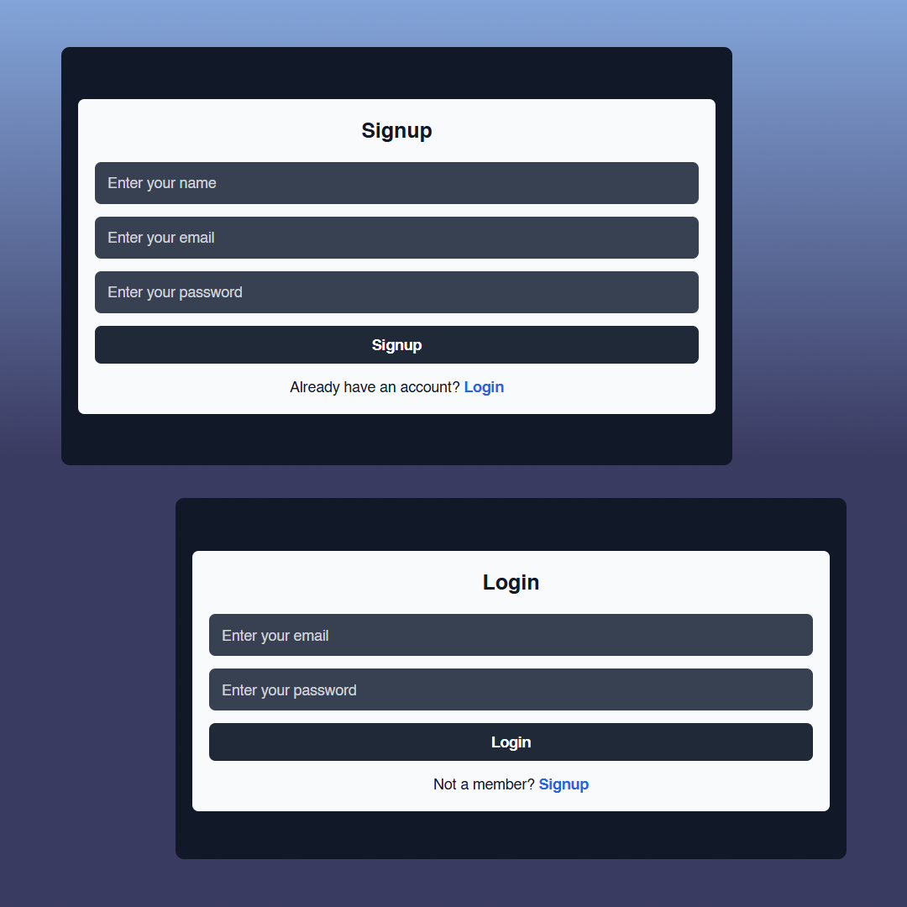
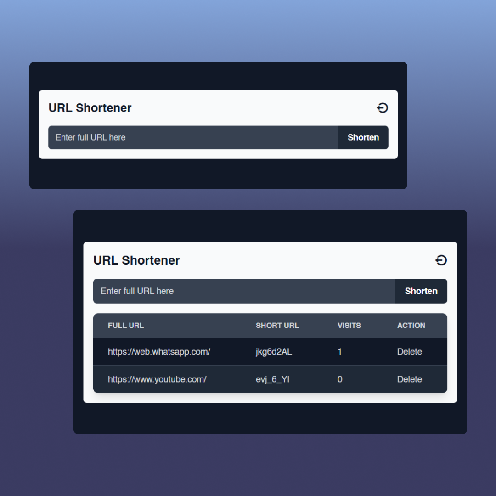

# URL Shortener

A simple URL shortener application built using Node.js, Express, MongoDB, and EJS. The application allows users to shorten URLs, track their visits, and manage their links.

## Features

- **User Authentication**: Signup, Login, and Logout functionality using JWT.
- **URL Shortening**: Convert long URLs into compact links.
- **Visit Tracking**: Monitor the total number of visits for each short URL.
- **URL Management**: View and delete URLs from your list.
- **Responsive Design**: Styled with TailwindCSS for a modern, mobile-friendly UI.

## Technologies Used

- **Backend**: Node.js, Express
- **Frontend**: EJS, TailwindCSS
- **Database**: MongoDB
- **Authentication**: JSON Web Tokens (JWT)

## API Endpoints

### User Routes

- POST /user: Register a new user
- POST /user/login: Login user
- GET /user/logout: Logout a user (clears authentication cookie).

### URL Routes

- POST /url: Create a short URL
- GET /url/:shortURL: Redirect to the original URL
- DELETE /url/:shortURL: Delete a short URL

## Screenshots

### Signup-Login Page

### Home Page

